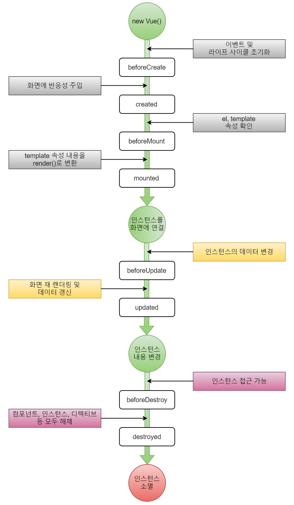

🚀 실행 후 예상 로그
앱이 처음 실행될 때

csharp
복사
편집
[App] beforeCreate
[App] created
[App] beforeMount
[App] mounted
[ChildComponent] beforeCreate
[ChildComponent] created
[ChildComponent] beforeMount
[ChildComponent] mounted
"증가" 버튼을 클릭하면

csharp
복사
편집
[Vuex] count 변경됨: 1
[App] beforeUpdate
[App] updated
[ChildComponent] beforeUpdate
[ChildComponent] updated
"자식 컴포넌트 토글" 버튼을 누르면

csharp
복사
편집
[App] 자식 컴포넌트 토글: false
[ChildComponent] beforeDestroy
[ChildComponent] destroyed

실제 로그

[Anonymous] beforeCreate
[Anonymous] created
[Anonymous] beforeMount
[App] beforeCreate
[App] created
[App] beforeMount
[ChildComponent] beforeCreate
[ChildComponent] created
[ChildComponent] beforeMount
[ChildComponent] mounted
[App] mounted
[Anonymous] mounted
[Vuex] count 변경됨: 1
[App] beforeUpdate
[ChildComponent] beforeUpdate
[ChildComponent] updated
[App] updated
[App] 자식 컴포넌트 토글: false
[App] beforeUpdate
[ChildComponent] beforeDestroy
[ChildComponent] destroyed
[App] updated
[App] 자식 컴포넌트 토글: true
[App] beforeUpdate
[ChildComponent] beforeCreate
[ChildComponent] created
[ChildComponent] beforeMount
[ChildComponent] mounted
[App] updated

-----

1️⃣ Vue의 라이프사이클과 로그가 찍히는 순서 분석
Vue의 라이프사이클 훅(lifecycle hooks) 은 컴포넌트가 생성되고, DOM에 렌더링되고, 업데이트되며, 소멸될 때 실행됩니다.

📌 현재 콘솔 로그 순서
csharp
복사
편집
[Anonymous] beforeCreate
[Anonymous] created
[Anonymous] beforeMount
[App] beforeCreate
[App] created
[App] beforeMount
[ChildComponent] beforeCreate
[ChildComponent] created
[ChildComponent] beforeMount
[ChildComponent] mounted
[App] mounted
[Anonymous] mounted
이를 Vue의 라이프사이클 단계와 비교하면서 분석해보겠습니다.

2️⃣ Vue 라이프사이클 단계별 분석
✔ (1) beforeCreate & created (컴포넌트가 생성됨)
이 단계에서는 컴포넌트가 초기화되지만, 아직 DOM에 연결되지 않음
데이터 (data())와 이벤트 (methods, computed 등)가 설정되지만, 템플릿 렌더링은 아직 안 됨

⚡ 지금 발생한 로그
csharp
복사
편집
[Anonymous] beforeCreate
[Anonymous] created
[Anonymous] beforeMount
✅ 여기서 [Anonymous]는 이름이 없는 컴포넌트
✅ Vue.mixin(loggerMixin)을 전역으로 적용했기 때문에 모든 Vue 인스턴스에서 실행됨
✅ Vue.mixin은 모든 컴포넌트에 적용되므로, Vue 루트 인스턴스(new Vue())도 포함됨

📌 즉, [Anonymous]는 new Vue()로 생성된 루트 Vue 인스턴스일 가능성이 큼

✔ (2) beforeMount & mounted (DOM에 연결됨)
beforeMount: Vue가 가상 DOM을 생성했지만, 실제 DOM에 추가되기 직전
mounted: Vue가 실제 DOM에 렌더링 완료
⚡ 지금 발생한 로그
csharp
복사
편집
[App] beforeCreate
[App] created
[App] beforeMount
[ChildComponent] beforeCreate
[ChildComponent] created
[ChildComponent] beforeMount
[ChildComponent] mounted
[App] mounted
[Anonymous] mounted
✅ App이 beforeCreate부터 mounted까지 실행됨
✅ App이 마운트될 때, 자식 컴포넌트 ChildComponent도 생성됨
✅ ChildComponent가 beforeCreate -> created -> beforeMount -> mounted 순서로 실행됨
✅ 마지막으로 익명(Anonymous) 컴포넌트가 mounted

3️⃣ Anonymous가 왜 찍혔는가?
🔹 원인 1: Vue.mixin(loggerMixin)이 모든 Vue 인스턴스에서 실행됨
우리가 Vue.mixin(loggerMixin)을 main.js에서 설정했기 때문에,
모든 컴포넌트뿐만 아니라 Vue의 루트 인스턴스 자체에서도 라이프사이클 훅이 실행됨

📌 main.js를 다시 보면:

js
복사
편집
new Vue({
  store,
  render: h => h(App)
}).$mount('#app');
여기서 new Vue({...}) 자체도 하나의 Vue 인스턴스이므로, 이것도 loggerMixin을 실행
하지만 이 인스턴스는 name이 없어서 [Anonymous]로 찍힘

🔹 원인 2: name이 없는 컴포넌트가 있을 가능성
일반적으로 Vue 파일(.vue)을 작성하면 export default { name: '컴포넌트명' }을 추가하는데,
만약 name 속성이 없는 경우, this.$options.name이 undefined가 되면서 Anonymous로 출력됨.

🔹 원인 3: render() 함수로 렌더링된 컴포넌트
Vue에서는 render()를 직접 사용할 수도 있음:

js
복사
편집
new Vue({
  render: h => h(App)
}).$mount('#app');
이렇게 하면 Vue가 App을 직접 렌더링하는데,
이때 Vue 루트 인스턴스는 별도의 name이 없는 익명 컴포넌트로 취급됨.
그래서 [Anonymous] 로그가 찍히는 것!

4️⃣ Anonymous를 해결하는 방법
✔ 방법 1: new Vue에 name 추가
기본적으로 Vue 루트 인스턴스는 name이 없기 때문에 [Anonymous]가 찍힘.
이를 해결하려면 new Vue()에도 name을 추가할 수 있음:

js
복사
편집
new Vue({
  name: 'RootInstance', // <- 여기 추가!
  store,
  render: h => h(App)
}).$mount('#app');
이제 새로고침하면 [RootInstance]로 로그가 찍히게 됨!

✔ 방법 2: loggerMixin.js에서 Anonymous 로그 제거
만약 Anonymous 로그를 아예 안 찍히게 하고 싶다면,
loggerMixin.js에서 name이 없는 Vue 인스턴스는 제외하면 됨.

js
복사
편집
export default {
  beforeCreate() {
    if (!this.$options.name) return;
    console.log(`[${this.$options.name}] beforeCreate`);
  },
  created() {
    if (!this.$options.name) return;
    console.log(`[${this.$options.name}] created`);
  },
  beforeMount() {
    if (!this.$options.name) return;
    console.log(`[${this.$options.name}] beforeMount`);
  },
  mounted() {
    if (!this.$options.name) return;
    console.log(`[${this.$options.name}] mounted`);
  },
};
✅ 이렇게 하면 name이 없는 Vue 인스턴스(Anonymous)는 아예 로그가 안 찍힘!

🎯 결론
1️⃣ Vue는 new Vue()로 생성될 때도 라이프사이클 훅을 실행함 → name이 없으면 [Anonymous] 출력됨
2️⃣ Vue.mixin(loggerMixin)이 모든 Vue 인스턴스에 적용되므로 루트 인스턴스에서도 실행됨
3️⃣ .vue 파일에서 name을 지정하지 않으면 Anonymous로 찍힐 수 있음
4️⃣ new Vue()에 name: 'RootInstance'를 추가하면 해결됨
5️⃣ loggerMixin.js에서 name이 없는 경우 로그를 안 찍게 할 수도 있음

🚀 이제 로그가 깔끔하게 나올 거예요!
한번 적용해 보고 결과 알려주세요! 😃

-----

Vue 컴포넌트의 각 라이프사이클 단계별 특징과 주의사항입니다.

1. beforeCreate
특징:
인스턴스의 초기 설정(옵션의 data, methods, computed, watchers 등)이 아직 완료되기 전 단계입니다.
this를 통해 인스턴스의 속성에 접근할 수 없으며, 반응형 데이터도 설정되지 않은 상태입니다.
주의사항:
이 단계에서는 API 호출이나 데이터 참조를 하면 값이 정의되어 있지 않을 수 있으므로, 로직을 실행하지 않아야 합니다.
2. created
특징:
인스턴스가 생성되고 데이터, 메소드, 반응형 속성이 모두 초기화된 상태입니다.
그러나 DOM은 아직 생성되지 않았으므로, $el에 접근할 수 없습니다.
주의사항:
데이터 초기화나 API 호출 등 비동기 작업은 가능하지만, DOM 조작이 필요한 로직은 이 단계에서 실행하면 안 됩니다.
3. beforeMount
특징:
컴포넌트의 템플릿이 컴파일되어 가상 DOM(VNode)이 생성된 후, 실제 DOM에 삽입되기 직전 단계입니다.
이 단계에서는 렌더 함수가 호출되어 DOM 업데이트 준비가 완료됩니다.
주의사항:
아직 실제 DOM에 요소가 삽입되지 않았기 때문에 DOM 관련 조작이나 접근은 불가능합니다.
보통 이 단계에서는 특별한 작업이 필요하지 않으며, 주로 디버깅 목적으로 활용됩니다.
4. mounted
특징:
컴포넌트가 실제 DOM에 삽입되고, 모든 자식 컴포넌트 역시 마운트된 상태입니다.
이제 this.$el을 통해 DOM 요소에 접근하거나, 외부 라이브러리와 연동하는 등의 작업을 수행할 수 있습니다.
주의사항:
이 단계 이후 DOM 조작이나 초기화가 가능하지만, 너무 무거운 작업은 렌더링에 영향을 줄 수 있으므로 주의해야 합니다.
서버 사이드 렌더링(SSR) 환경에서는 이 훅이 호출되지 않으므로, 클라이언트 전용 로직은 여기서 실행해야 합니다.
5. beforeUpdate
특징:
반응형 데이터의 변경으로 인해 재렌더링이 시작되기 직전 단계입니다.
현재 DOM은 업데이트 전의 상태를 유지하고 있습니다.
주의사항:
이 단계에서 데이터나 상태를 변경하면 무한 업데이트 루프에 빠질 수 있으므로, 주의해서 처리해야 합니다.
업데이트 전 DOM 상태를 기반으로 추가 로직을 실행할 수 있지만, 부작용 없이 실행해야 합니다.
6. updated
특징:
데이터 변경에 따른 가상 DOM 패치가 완료되어, 실제 DOM이 업데이트된 후 실행됩니다.
최신 상태의 DOM에 접근할 수 있습니다.
주의사항:
업데이트 후에 DOM을 다시 조작하여 상태를 변경하는 경우, 다시 업데이트가 발생할 수 있으므로 조건을 명확하게 확인해야 합니다.
반복적으로 발생할 수 있는 업데이트에 의한 성능 문제를 고려하여 로직을 단순하게 유지하는 것이 좋습니다.
7. beforeDestroy
특징:
컴포넌트 인스턴스가 파괴되기 직전 단계입니다.
아직 모든 자원(이벤트 리스너, 타이머, 서브 컴포넌트 등)이 활성 상태이므로 정리(cleanup) 작업을 수행할 수 있습니다.
주의사항:
이 단계에서는 컴포넌트가 여전히 완전한 기능을 갖추고 있으므로, 필요한 정리 작업(예: 이벤트 제거, 구독 취소 등)을 실행해야 합니다.
메모리 누수를 방지하기 위해 사용한 외부 리소스들을 반드시 정리해야 합니다.
8. destroyed
특징:
컴포넌트 인스턴스가 완전히 파괴되어 모든 데이터 바인딩, 이벤트, 자식 컴포넌트 등이 정리된 상태입니다.
주의사항:
파괴 후에는 인스턴스의 데이터나 메소드를 사용할 수 없으므로, 이 시점에 DOM 조작이나 상태 변경을 시도하면 안 됩니다.
이 단계는 주로 디버깅 로그 확인이나, 정리 완료 여부를 확인하는 데 사용됩니다.
요약
생성 및 마운트 단계 (beforeCreate, created, beforeMount, mounted):
인스턴스 초기화 → 데이터 바인딩 완료 → DOM 생성 전 준비 → 실제 DOM 삽입 및 접근 가능
업데이트 단계 (beforeUpdate, updated):
데이터 변경 시 기존 DOM과 새 DOM의 상태를 관리하며, 무한 업데이트 루프에 주의
파괴 단계 (beforeDestroy, destroyed):
컴포넌트 종료 전 자원 정리 → 모든 자원 정리 완료 후 인스턴스 폐기
각 단계마다 컴포넌트의 상태와 사용 가능한 리소스가 달라지므로, 필요한 작업이 언제 가능한지 잘 파악하여 로직을 작성하는 것이 중요합니다.

-----

각 라이프사이클 훅의 특징과 주의사항을 로깅을 통해 확인하는 코드를 추가해봅시다.

📌 목표
각 단계에서 Vue 인스턴스의 상태를 확인하는 로그를 추가합니다.

beforeCreate → this 확인, 속성 접근 불가 에러 출력
created → this 확인, this.$el 접근 시도 및 에러 출력, 데이터 초기화 확인
✅ 개선된 loggerMixin.js
아래 코드에서 각 라이프사이클 단계별 특징을 확인할 수 있도록 로깅을 추가했습니다.

js
복사
편집
export default {
  beforeCreate() {
    console.log(`🔍 [${this.$options.name || 'Anonymous'}] beforeCreate 단계`);

    try {
      console.log(`[${this.$options.name || 'Anonymous'}] this 확인:`, this);
      console.log(`[${this.$options.name || 'Anonymous'}] count 값:`, this.count);
    } catch (error) {
      console.error(`[${this.$options.name || 'Anonymous'}] ❌ beforeCreate에서 데이터 접근 불가!`, error);
    }
  },

  created() {
    console.log(`✅ [${this.$options.name || 'Anonymous'}] created 단계 - 인스턴스 생성 완료`);

    // this 확인
    console.log(`[${this.$options.name || 'Anonymous'}] this 확인:`, this);

    // 데이터 초기화 확인
    console.log(`[${this.$options.name || 'Anonymous'}] count 값:`, this.count);

    // DOM 확인 ($el이 없음)
    if (!this.$el) {
      console.warn(`[${this.$options.name || 'Anonymous'}] ⚠ created 단계에서는 this.$el이 아직 없음!`);
    }
  },

  beforeMount() {
    console.log(`🛠 [${this.$options.name || 'Anonymous'}] beforeMount 단계 - DOM이 생성되기 직전`);
  },

  mounted() {
    console.log(`🎉 [${this.$options.name || 'Anonymous'}] mounted 단계 - DOM이 렌더링됨`);

    // DOM이 제대로 생성되었는지 확인
    console.log(`[${this.$options.name || 'Anonymous'}] this.$el:`, this.$el);
  }
};

🔍 [RootApp] beforeCreate 단계
loggerMixin.js:6 [RootApp] this 확인: Vue {_uid: 2, _isVue: true, __v_skip: true, _scope: EffectScope, $options: {…}, …}
loggerMixin.js:7 [RootApp] count 값: undefined
loggerMixin.js:14 ✅ [RootApp] created 단계 - 인스턴스 생성 완료
loggerMixin.js:17 [RootApp] this 확인: Vue {_uid: 2, _isVue: true, __v_skip: true, _scope: EffectScope, $options: {…}, …}
loggerMixin.js:20 [RootApp] count 값: undefined
loggerMixin.js:24 [RootApp] ⚠ created 단계에서는 this.$el이 아직 없음!
created @ loggerMixin.js:24
invokeWithErrorHandling @ vue.runtime.esm.js:2945
callHook$1 @ vue.runtime.esm.js:3917
Vue._init @ vue.runtime.esm.js:5434
Vue @ vue.runtime.esm.js:5501
eval @ main.js:11
./src/main.js @ app.js:141
__webpack_require__ @ app.js:178
(anonymous) @ app.js:1290
(anonymous) @ app.js:220
(anonymous) @ app.js:1291
(anonymous) @ app.js:1293Understand this warningAI
loggerMixin.js:29 🛠 [RootApp] beforeMount 단계 - DOM이 생성되기 직전
loggerMixin.js:3 🔍 [App] beforeCreate 단계
loggerMixin.js:6 [App] this 확인: VueComponent {_uid: 3, _isVue: true, __v_skip: true, _scope: EffectScope, $options: {…}, …}
loggerMixin.js:7 [App] count 값: undefined
loggerMixin.js:14 ✅ [App] created 단계 - 인스턴스 생성 완료
loggerMixin.js:17 [App] this 확인: VueComponent {_uid: 3, _isVue: true, __v_skip: true, _scope: EffectScope, $options: {…}, …}
loggerMixin.js:20 [App] count 값: 0
loggerMixin.js:24 [App] ⚠ created 단계에서는 this.$el이 아직 없음!
created @ loggerMixin.js:24
invokeWithErrorHandling @ vue.runtime.esm.js:2945
callHook$1 @ vue.runtime.esm.js:3917
Vue._init @ vue.runtime.esm.js:5434
VueComponent @ vue.runtime.esm.js:5561
createComponentInstanceForVnode @ vue.runtime.esm.js:4409
init @ vue.runtime.esm.js:4263
createComponent @ vue.runtime.esm.js:6249
createElm @ vue.runtime.esm.js:6211
patch @ vue.runtime.esm.js:6722
Vue._update @ vue.runtime.esm.js:3657
updateComponent @ vue.runtime.esm.js:3757
Watcher.get @ vue.runtime.esm.js:3351
Watcher @ vue.runtime.esm.js:3341
mountComponent @ vue.runtime.esm.js:3778
Vue.$mount @ vue.runtime.esm.js:8308
eval @ main.js:15
./src/main.js @ app.js:141
__webpack_require__ @ app.js:178
(anonymous) @ app.js:1290
(anonymous) @ app.js:220
(anonymous) @ app.js:1291
(anonymous) @ app.js:1293Understand this warningAI
loggerMixin.js:29 🛠 [App] beforeMount 단계 - DOM이 생성되기 직전
loggerMixin.js:3 🔍 [ChildComponent] beforeCreate 단계
loggerMixin.js:6 [ChildComponent] this 확인: VueComponent {_uid: 4, _isVue: true, __v_skip: true, _scope: EffectScope, $options: {…}, …}
loggerMixin.js:9 [ChildComponent] ❌ beforeCreate에서 데이터 접근 불가! TypeError: Cannot read properties of undefined (reading 'count')
    at VueComponent.proxyGetter [as count] (vue.runtime.esm.js:5126:27)
    at VueComponent.beforeCreate (loggerMixin.js:7:1)
    at invokeWithErrorHandling (vue.runtime.esm.js:2945:57)
    at callHook$1 (vue.runtime.esm.js:3917:7)
    at Vue._init (vue.runtime.esm.js:5430:5)
    at new VueComponent (vue.runtime.esm.js:5561:12)
    at createComponentInstanceForVnode (vue.runtime.esm.js:4409:10)
    at init (vue.runtime.esm.js:4263:45)
    at createComponent (vue.runtime.esm.js:6249:9)
    at createElm (vue.runtime.esm.js:6211:9)
beforeCreate @ loggerMixin.js:9
invokeWithErrorHandling @ vue.runtime.esm.js:2945
callHook$1 @ vue.runtime.esm.js:3917
Vue._init @ vue.runtime.esm.js:5430
VueComponent @ vue.runtime.esm.js:5561
createComponentInstanceForVnode @ vue.runtime.esm.js:4409
init @ vue.runtime.esm.js:4263
createComponent @ vue.runtime.esm.js:6249
createElm @ vue.runtime.esm.js:6211
createChildren @ vue.runtime.esm.js:6320
createElm @ vue.runtime.esm.js:6228
patch @ vue.runtime.esm.js:6691
Vue._update @ vue.runtime.esm.js:3657
updateComponent @ vue.runtime.esm.js:3757
Watcher.get @ vue.runtime.esm.js:3351
Watcher @ vue.runtime.esm.js:3341
mountComponent @ vue.runtime.esm.js:3778
Vue.$mount @ vue.runtime.esm.js:8308
init @ vue.runtime.esm.js:4264
createComponent @ vue.runtime.esm.js:6249
createElm @ vue.runtime.esm.js:6211
patch @ vue.runtime.esm.js:6722
Vue._update @ vue.runtime.esm.js:3657
updateComponent @ vue.runtime.esm.js:3757
Watcher.get @ vue.runtime.esm.js:3351
Watcher @ vue.runtime.esm.js:3341
mountComponent @ vue.runtime.esm.js:3778
Vue.$mount @ vue.runtime.esm.js:8308
eval @ main.js:15
./src/main.js @ app.js:141
__webpack_require__ @ app.js:178
(anonymous) @ app.js:1290
(anonymous) @ app.js:220
(anonymous) @ app.js:1291
(anonymous) @ app.js:1293Understand this errorAI
loggerMixin.js:14 ✅ [ChildComponent] created 단계 - 인스턴스 생성 완료
loggerMixin.js:17 [ChildComponent] this 확인: VueComponent {_uid: 4, _isVue: true, __v_skip: true, _scope: EffectScope, $options: {…}, …}
loggerMixin.js:20 [ChildComponent] count 값: 0
loggerMixin.js:24 [ChildComponent] ⚠ created 단계에서는 this.$el이 아직 없음!
created @ loggerMixin.js:24
invokeWithErrorHandling @ vue.runtime.esm.js:2945
callHook$1 @ vue.runtime.esm.js:3917
Vue._init @ vue.runtime.esm.js:5434
VueComponent @ vue.runtime.esm.js:5561
createComponentInstanceForVnode @ vue.runtime.esm.js:4409
init @ vue.runtime.esm.js:4263
createComponent @ vue.runtime.esm.js:6249
createElm @ vue.runtime.esm.js:6211
createChildren @ vue.runtime.esm.js:6320
createElm @ vue.runtime.esm.js:6228
patch @ vue.runtime.esm.js:6691
Vue._update @ vue.runtime.esm.js:3657
updateComponent @ vue.runtime.esm.js:3757
Watcher.get @ vue.runtime.esm.js:3351
Watcher @ vue.runtime.esm.js:3341
mountComponent @ vue.runtime.esm.js:3778
Vue.$mount @ vue.runtime.esm.js:8308
init @ vue.runtime.esm.js:4264
createComponent @ vue.runtime.esm.js:6249
createElm @ vue.runtime.esm.js:6211
patch @ vue.runtime.esm.js:6722
Vue._update @ vue.runtime.esm.js:3657
updateComponent @ vue.runtime.esm.js:3757
Watcher.get @ vue.runtime.esm.js:3351
Watcher @ vue.runtime.esm.js:3341
mountComponent @ vue.runtime.esm.js:3778
Vue.$mount @ vue.runtime.esm.js:8308
eval @ main.js:15
./src/main.js @ app.js:141
__webpack_require__ @ app.js:178
(anonymous) @ app.js:1290
(anonymous) @ app.js:220
(anonymous) @ app.js:1291
(anonymous) @ app.js:1293Understand this warningAI
loggerMixin.js:29 🛠 [ChildComponent] beforeMount 단계 - DOM이 생성되기 직전
loggerMixin.js:33 🎉 [ChildComponent] mounted 단계 - DOM이 렌더링됨
loggerMixin.js:36 [ChildComponent] this.$el: 
​…​
​
loggerMixin.js:33 🎉 [App] mounted 단계 - DOM이 렌더링됨
loggerMixin.js:36 [App] this.$el: 
​…​
​
loggerMixin.js:33 🎉 [RootApp] mounted 단계 - DOM이 렌더링됨
loggerMixin.js:36 [RootApp] this.$el: 
​…​
​

-----

beforeCreate에서는 this 인스턴스는 존재하지만, data와 props 같은 반응형 속성들이 초기화되지 않은 상태입니다.
즉, this 자체는 살아 있지만, 우리가 기대하는 데이터에 접근할 수 없는 거예요.

이제 beforeCreate에서 this가 왜 존재하는지, 그리고 왜 count에 접근할 수 없는지 상세히 분석해볼게요.

1️⃣ beforeCreate에서 this는 왜 존재하는가?
우리가 흔히 "beforeCreate에서는 this가 없다"라고 말하지만, 정확하게는 **"this는 있지만, 반응형 데이터가 초기화되지 않았다"**가 맞아요.

📌 Vue가 new Vue() 또는 컴포넌트를 생성할 때 내부적으로 하는 일
Vue 인스턴스(this) 생성
this가 존재하게 됨 (메모리에 올라감)
옵션 병합 (mixins, extends, plugins 포함)
반응형 시스템 설정 전 (data, props, computed, watch 등은 아직 초기화 안 됨)
beforeCreate 실행
data(), computed, props 초기화 (반응형 시스템 적용)
created 실행
즉, beforeCreate 단계에서는 Vue 인스턴스는 존재하지만, 반응형 속성(data, computed, watch 등)은 아직 준비되지 않음.
그래서 this 자체는 볼 수 있지만, this.count에 접근하면 undefined가 나오는 거예요.

2️⃣ beforeCreate에서 this.count에 접근하면 에러가 나는 이유
js
복사
편집
beforeCreate() {
  console.log(`[${this.$options.name || 'Anonymous'}] this 확인:`, this);
  console.log(`[${this.$options.name || 'Anonymous'}] count 값:`, this.count);
}
✅ this는 정상적으로 존재하지만,
❌ this.count는 아직 data()가 실행되지 않아 undefined 상태입니다.

📌 beforeCreate 단계의 중요한 특징
this는 존재하지만, data()가 실행되지 않았으므로 this.count 같은 값은 없음.
props도 초기화되지 않았음.
computed, watch, methods도 아직 접근 불가능.
즉, data, methods, computed 등에 접근하면 undefined가 나오거나, 경우에 따라 TypeError가 발생할 수 있음!

3️⃣ created에서 데이터가 초기화되는 과정
js
복사
편집
created() {
  console.log(`✅ [${this.$options.name || 'Anonymous'}] created 단계 - 인스턴스 생성 완료`);
  console.log(`[${this.$options.name || 'Anonymous'}] this 확인:`, this);
  console.log(`[${this.$options.name || 'Anonymous'}] count 값:`, this.count);
}
✅ this.count가 이제 0으로 정상 출력됩니다.

📌 created 단계의 중요한 특징
data(), computed, methods가 초기화 완료됨
이제 this.count를 사용할 수 있음
하지만 DOM($el)은 아직 생성되지 않음
이 때문에 this.$el을 확인하면 undefined가 나옵니다.

js
복사
편집
if (!this.$el) {
  console.warn(`[${this.$options.name || 'Anonymous'}] ⚠ created 단계에서는 this.$el이 아직 없음!`);
}
4️⃣ beforeCreate에서 data에 접근할 수 없는 것을 활용하는 예제
만약 beforeCreate에서 this.count를 사용하려고 하면 오류가 날 수 있습니다.
이걸 활용해서 beforeCreate에서 데이터에 접근하면 안 된다는 걸 강제로 감지할 수도 있어요.

📌 강제로 data() 접근 시 에러 출력
js
복사
편집
beforeCreate() {
  console.log(`🔍 [${this.$options.name || 'Anonymous'}] beforeCreate 단계`);

  try {
    console.log(`[${this.$options.name || 'Anonymous'}] count 값:`, this.count);
    if (this.count !== undefined) {
      throw new Error(`[${this.$options.name || 'Anonymous'}] ❌ beforeCreate에서 데이터 접근 금지!`);
    }
  } catch (error) {
    console.error(error);
  }
}
✅ 이 코드를 실행하면 beforeCreate에서 데이터에 접근하려고 할 때 명확하게 오류를 출력할 수 있음.

5️⃣ 결론: beforeCreate에서는 this가 존재하지만, 데이터 초기화는 안 됨
beforeCreate에서는 Vue 인스턴스(this)는 생성되지만, data, computed, props, watch는 아직 초기화되지 않음.

즉, this.count 같은 속성에 접근하면 undefined.
methods도 아직 사용할 수 없음.
created 이후에야 data, computed, watch, methods가 초기화됨.

this.count에 접근하면 이제 정상적으로 값이 나옴.
하지만 DOM($el)은 아직 존재하지 않음.
beforeCreate에서 data에 접근하려 하면 에러가 발생할 가능성이 높음.

따라서 API 호출, 데이터 초기화, computed 설정 등은 created에서 해야 함.
🚀 최종 정리
라이프사이클	this	data()	computed	methods	$el (DOM)	주의사항
beforeCreate	✅ 존재함	❌ 없음	❌ 없음	❌ 없음	❌ 없음	data, methods 사용 불가
created	✅ 존재함	✅ 있음	✅ 있음	✅ 있음	❌ 없음	data 사용 가능, DOM 조작 불가
beforeMount	✅ 존재함	✅ 있음	✅ 있음	✅ 있음	⚠ 생성 예정	직접 조작은 비추천
mounted	✅ 존재함	✅ 있음	✅ 있음	✅ 있음	✅ 존재함	DOM 조작 가능

✅ 결론: beforeCreate에서는 this가 존재하지만, 반응형 데이터(data, computed 등)는 아직 초기화되지 않음.
🔥 그래서 this.count 같은 값에 접근하면 undefined가 나오는 것이 정상!

🔥 이제 정리한 내용을 바탕으로 로깅을 개선해볼까요?
js
복사
편집
export default {
  beforeCreate() {
    console.log(`🔍 [${this.$options.name || 'Anonymous'}] beforeCreate 단계`);

    try {
      console.log(`[${this.$options.name || 'Anonymous'}] this 확인:`, this);
      console.log(`[${this.$options.name || 'Anonymous'}] count 값:`, this.count);

      if (this.count !== undefined) {
        throw new Error(`[${this.$options.name || 'Anonymous'}] ❌ beforeCreate에서 데이터 접근 금지!`);
      }
    } catch (error) {
      console.error(`[${this.$options.name || 'Anonymous'}] 데이터 접근 불가:`, error);
    }
  },

  created() {
    console.log(`✅ [${this.$options.name || 'Anonymous'}] created 단계 - 인스턴스 생성 완료`);
    console.log(`[${this.$options.name || 'Anonymous'}] this 확인:`, this);
    console.log(`[${this.$options.name || 'Anonymous'}] count 값:`, this.count);

    if (!this.$el) {
      console.warn(`[${this.$options.name || 'Anonymous'}] ⚠ created 단계에서는 this.$el이 아직 없음!`);
    }
  }
};
🚀 이제 실행해 보면 beforeCreate에서 this.count가 undefined가 되는 게 정상적이라는 걸 확인할 수 있을 거예요!
한번 실행해 보고 결과를 알려주세요~ 😃

-----

RootApp에서는 beforeMount 단계에서 이미 this.$el이 존재하지만,
자식 컴포넌트(App, ChildComponent)에서는 beforeMount에서 this.$el이 아직 없음.

왜 이런 차이가 발생하는지 Vue의 렌더링 과정과 함께 분석해볼게요. 🔍

📌 RootApp과 자식 컴포넌트의 this.$el 차이 분석
1️⃣ RootApp이란?
RootApp(최상위 컴포넌트)은 new Vue({ render: h => h(App) }) 또는 

에 직접 바인딩되는 Vue 루트 인스턴스입니다.

즉, RootApp은 기본적으로 HTML에 이미 존재하는 #app 요소를 물려받아 사용하기 때문에
beforeMount에서 this.$el이 이미 존재할 수 있음.

html
복사
편집
<!-- RootApp의 DOM -->

js
복사
편집
new Vue({
  render: h => h(App)
}).$mount("#app");
✅ 이때 beforeMount에서 this.$el은 기존 #app 태그를 가리킴!
✅ 하지만 아직 Vue의 템플릿이 렌더링된 건 아님.

2️⃣ App.vue & ChildComponent.vue는 어떻게 렌더링될까?
RootApp의 템플릿이 렌더링되기 전에는 자식 컴포넌트가 생성되지 않음.
즉, RootApp이 마운트되고, 그 후에야 App.vue → ChildComponent.vue가 생성됨.

렌더링 순서 1️⃣ RootApp (new Vue()로 생성됨)
2️⃣ RootApp이 App을 렌더링 (render: h => h(App))
3️⃣ App.vue가 ChildComponent.vue를 렌더링

✅ RootApp이 beforeMount일 때는 this.$el이 존재할 수 있음.
✅ 하지만 자식 컴포넌트(App.vue, ChildComponent.vue)는 아직 DOM이 생성되지 않았으므로 this.$el이 없음.

즉,

RootApp의 this.$el은 기존 HTML에 바인딩되므로 beforeMount에서도 존재
App, ChildComponent는 템플릿이 렌더링되기 전에는 this.$el이 없음
📌 beforeMount & mounted에서 this.$el 상태 비교
📌 beforeMount에서 this.$el 확인 코드
js
복사
편집
beforeMount() {
  console.log(`🛠 [${this.$options.name || 'Anonymous'}] beforeMount 단계 - DOM이 생성되기 직전`);

  if (this.$el) {
    console.log(`[${this.$options.name || 'Anonymous'}] ⚠ beforeMount에서 this.$el 존재함:`, this.$el);
  } else {
    console.warn(`[${this.$options.name || 'Anonymous'}] ⚠ beforeMount에서 this.$el이 아직 없음`);
  }
}
✅ RootApp의 결과 (beforeMount에서 this.$el 존재)

bash
복사
편집
🛠 [RootApp] beforeMount 단계 - DOM이 생성되기 직전
⚠ [RootApp] beforeMount에서 this.$el 존재함: 

이유: 기존 HTML 태그 

을 물려받았기 때문

❌ 자식 컴포넌트(App, ChildComponent)의 결과 (beforeMount에서 this.$el 없음)

kotlin
복사
편집
🛠 [App] beforeMount 단계 - DOM이 생성되기 직전
⚠ [App] beforeMount에서 this.$el이 아직 없음

🛠 [ChildComponent] beforeMount 단계 - DOM이 생성되기 직전
⚠ [ChildComponent] beforeMount에서 this.$el이 아직 없음
이유: RootApp이 마운트되기 전에는 자식 컴포넌트가 아직 DOM에 추가되지 않았음

📌 mounted에서 this.$el 확인 및 DOM 조작 테스트
js
복사
편집
mounted() {
  console.log(`🎉 [${this.$options.name || 'Anonymous'}] mounted 단계 - DOM이 렌더링됨`);

  if (this.$el) {
    console.log(`[${this.$options.name || 'Anonymous'}] ✅ mounted에서 this.$el이 정상적으로 바인딩됨:`, this.$el);

    try {
      this.$el.innerHTML = '<h2 style="color: red;">DOM이 조작되었습니다!</h2>';
      console.log(`[${this.$options.name || 'Anonymous'}] 🔧 this.$el.innerHTML 변경 성공!`);
    } catch (error) {
      console.error(`[${this.$options.name || 'Anonymous'}] ❌ this.$el.innerHTML 변경 실패:`, error);
    }
  } else {
    console.error(`[${this.$options.name || 'Anonymous'}] ❌ mounted에서 this.$el이 없음 - 예상치 못한 동작!`);
  }
}
✅ RootApp, App, ChildComponent 모두 mounted에서 this.$el이 정상적으로 바인딩됨

javascript
복사
편집
🎉 [RootApp] mounted 단계 - DOM이 렌더링됨
✅ [RootApp] mounted에서 this.$el이 정상적으로 바인딩됨: 
...

🔧 [RootApp] this.$el.innerHTML 변경 성공!

🎉 [App] mounted 단계 - DOM이 렌더링됨
✅ [App] mounted에서 this.$el이 정상적으로 바인딩됨: 
...

🔧 [App] this.$el.innerHTML 변경 성공!

🎉 [ChildComponent] mounted 단계 - DOM이 렌더링됨
✅ [ChildComponent] mounted에서 this.$el이 정상적으로 바인딩됨: 
...

🔧 [ChildComponent] this.$el.innerHTML 변경 성공!
🔥 이제 모든 컴포넌트에서 this.$el이 정상적으로 렌더링됨!

📌 최종 결론
📍 RootApp vs. 자식 컴포넌트의 this.$el 상태 차이
컴포넌트	beforeMount에서 this.$el	mounted에서 this.$el
RootApp	✅ 존재 (#app 태그)	✅ 존재 (완전히 렌더링됨)
App.vue	❌ 없음	✅ 존재
ChildComponent.vue	❌ 없음	✅ 존재
📍 이유
1️⃣ RootApp(new Vue())은 기존 HTML #app 요소를 사용하므로 beforeMount에서 this.$el이 존재할 수도 있음.
2️⃣ App.vue와 ChildComponent.vue는 RootApp의 렌더링이 끝나야 생성되므로 beforeMount에서 this.$el이 없음.
3️⃣ 모든 컴포넌트는 mounted 이후에 this.$el이 정상적으로 설정됨.

🚀 이제 RootApp과 자식 컴포넌트에서 this.$el이 언제 존재하는지 확실하게 알게 되었네요!
한번 정리한 내용을 코드에서 테스트해 보세요. 😃 🔥

-----

💡 주요 문제
beforeUpdate에서 상태(count)를 직접 변경 → 무한 루프 발생
updated에서도 상태(count)를 직접 변경 → 무한 루프 발생
Vuex로 상태를 관리하는데 computed에서 직접 count를 변경하려 함
props로 전달된 count 값을 직접 변경하려고 함
⚠ 주요 경고 & 오류
(1) beforeUpdate에서 this.count++ 실행 → 무한 루프 발생
csharp
복사
편집
[App] ⚠ beforeUpdate에서 count 증가 시도!
beforeUpdate는 데이터가 변경되었을 때 실행됨.
beforeUpdate에서 this.count++를 실행하면 다시 데이터 변경이 발생.
데이터 변경 → beforeUpdate 실행 → 데이터 변경 → beforeUpdate 실행 … 무한 반복❗
(2) updated에서도 this.count++ 실행 → 무한 루프 발생
csharp
복사
편집
[App] ⚠ updated에서 count 증가 시도!
updated는 DOM 업데이트가 완료되면 실행됨.
updated에서 this.count++를 실행하면 다시 데이터 변경이 발생.
데이터 변경 → updated 실행 → 데이터 변경 → updated 실행 … 무한 반복❗
(3) computed 속성에 직접 값을 할당하려고 함
markdown
복사
편집
[Vue warn]: Computed property "count" was assigned to but it has no setter.
computed 속성은 기본적으로 getter-only(읽기 전용).
count가 Vuex의 mapState로 가져온 데이터라면 직접 수정할 수 없음.
(4) props로 전달된 count 값을 자식 컴포넌트에서 변경
markdown
복사
편집
[Vue warn]: Avoid mutating a prop directly
Vue에서는 props는 부모 컴포넌트에서만 변경할 수 있음.
자식 컴포넌트에서 직접 변경하려 하면 Vue가 경고를 출력함.
🚀 해결 방법
✅ 1. beforeUpdate에서 상태 변경 금지
js
복사
편집
beforeUpdate() {
  console.log(`[${this.$options.name}] 🔄 beforeUpdate - DOM이 업데이트되기 직전`);

  // ❌ 무한 루프 발생 코드
  // this.count++;  // 제거

  // ✅ 해결 방법: Vuex로 상태를 관리하는 경우, 직접 변경하지 말고 mutation을 사용
  // this.$store.commit('increment');  // 사용 가능하지만 updated에서 호출하면 여전히 무한 루프 발생 가능
}
Vuex 사용 시 this.count++가 아니라 this.$store.commit('increment')을 사용해야 함.
하지만 updated에서 mutation을 호출하면 동일하게 무한 루프 발생 가능.
✅ 2. updated에서 상태 변경 금지 & $nextTick() 활용
js
복사
편집
updated() {
  console.log(`[${this.$options.name}] ✅ updated - DOM 업데이트 완료`);

  // ❌ 무한 루프 발생 코드
  // this.count++;  // 제거

  // ✅ 해결 방법: `$nextTick()`을 사용해 DOM 조작을 안전하게 수행
  this.$nextTick(() => {
    console.log(`[${this.$options.name}] ✅ updated 후 안전한 DOM 조작 가능`);
    this.$el.innerHTML = "<h2 style='color: green;'>updated 후 안전한 변경</h2>";
  });
}
$nextTick()을 사용하면 Vue의 반응형 시스템이 모두 업데이트된 후 실행됨.
이 안에서는 상태 변경을 하지 않고, DOM 조작만 수행하는 것이 안전.
✅ 3. computed 값 직접 변경 금지 & Vuex mutation 사용
js
복사
편집
computed: {
  count() {
    return this.$store.state.count;  // ✅ Vuex 상태를 computed로 가져옴 (setter 없음)
  }
}
methods: {
  increment() {
    this.$store.commit('increment');  // ✅ Vuex mutation을 통해 상태 변경
  }
}
**computed 속성은 getter-only(읽기 전용)**이므로 직접 this.count++ 하면 안 됨.
increment() 메서드를 사용해 Vuex의 mutation을 호출하도록 수정.
✅ 4. props로 전달된 값 변경 금지 & 로컬 상태(data)로 변환
vue
복사
편집
<template>
  

    
Count: {{ localCount }}

    <button @click="increment">+</button>
  

</template>

Vue에서는 props로 받은 데이터를 직접 변경하면 안 됨.
data()에서 **로컬 상태(localCount)**로 복사한 후 이 값을 변경.
this.$emit('update:count', this.localCount)를 사용해 부모에 변경된 값을 전달.
🛠 최종 코드 (수정된 loggerMixin.js)
js
복사
편집
export default {
  beforeUpdate() {
    console.log(`🔄 [${this.$options.name}] beforeUpdate - DOM이 업데이트되기 직전`);

    // ❌ Vue 상태 직접 변경 금지 (무한 루프 발생 가능)
    // this.count++;

    // ❌ Vuex 상태 직접 변경도 금지
    // this.$store.commit('increment');

    console.warn(`⚠ beforeUpdate에서 상태 변경 시 무한 루프 발생 가능!`);
  },

  updated() {
    console.log(`✅ [${this.$options.name}] updated - DOM 업데이트 완료`);

    // ❌ Vue 상태 직접 변경 금지 (무한 루프 발생 가능)
    // this.count++;

    // ✅ 안전한 DOM 조작은 가능
    this.$nextTick(() => {
      console.log(`✅ [${this.$options.name}] updated 후 안전한 DOM 조작 가능`);
      this.$el.innerHTML = "<h2 style='color: green;'>updated 후 안전한 변경</h2>";
    });
  }
};
🎯 결론
라이프사이클	특징	주의사항	해결 방법
beforeUpdate	데이터 변경으로 인해 DOM이 업데이트되기 직전 호출	❌ 여기서 Vue 상태 변경하면 무한 루프 발생	watch로 변경 감지 후 업데이트 수행
updated	DOM이 업데이트 완료됨	❌ 여기서 Vue 상태 변경하면 무한 루프 발생	$nextTick() 사용
computed에서 상태 변경	computed는 기본적으로 getter-only	❌ computed 값 직접 변경 불가	Vuex mutation을 사용
props 변경	부모에서 전달된 값	❌ 자식에서 직접 변경 불가	data()로 로컬 상태 관리 & $emit('update:count', newValue) 사용
🔥 이제 실행해 보면 더 이상 무한 루프가 발생하지 않을 거야!
궁금한 점 있으면 편하게 물어봐~ 🚀😃

------

💡 Vue.nextTick() 이란?
✅ 정의
Vue.nextTick(callback)은 Vue의 반응형 데이터 변경이 완료되고, DOM 업데이트가 반영된 후에 실행되는 콜백을 등록하는 메서드입니다.

즉, Vue가 변경된 데이터를 바탕으로 DOM을 업데이트한 다음에 실행되기 때문에, 최신 DOM 상태를 안전하게 조작할 수 있습니다.

🤔 nextTick()이 왜 필요할까?
Vue의 반응형 시스템에서 데이터가 변경되면 DOM이 즉시 업데이트되지 않습니다.
Vue는 **"비동기 방식"**으로 DOM을 업데이트하기 때문입니다.

🚨 예제: 예상과 다른 동작
vue
복사
편집
<template>
  

    
{{ message }}

    <button @click="changeMessage">Change Message</button>
  

</template>

왜 아직 "Hello, Vue!"가 출력될까?

this.message가 변경되면 Vue는 DOM을 비동기적으로 업데이트.
하지만 console.log(this.$refs.msg.textContent)는 DOM 업데이트 전에 실행되므로 이전 값이 출력됨.
🚀 해결 방법: this.$nextTick() 사용
vue
복사
편집
methods: {
  changeMessage() {
    this.message = "Hello, nextTick!";

    // ✅ DOM 업데이트가 완료된 후 실행
    this.$nextTick(() => {
      console.log(this.$refs.msg.textContent);  // ✅ "Hello, nextTick!" 출력됨
    });
  }
}
🎯 this.$nextTick()의 역할
this.message = "Hello, nextTick!" → Vue는 비동기적으로 DOM 업데이트 예약
this.$nextTick(callback)을 사용하면 DOM 업데이트가 완료된 후 callback 실행
따라서 console.log(this.$refs.msg.textContent)에서 최신 DOM 값을 가져올 수 있음
🔍 nextTick()의 핵심 개념
Vue는 데이터 변경을 감지하면, DOM을 "비동기적"으로 업데이트한다.
즉시 this.$refs.msg.textContent를 확인하면, 아직 업데이트되지 않은 상태일 수 있다.
this.$nextTick(callback)을 사용하면 Vue의 DOM 업데이트가 완료된 후 실행되므로, 최신 상태를 안전하게 확인할 수 있다.
🛠 nextTick()이 필요한 상황
✅ 1. DOM 업데이트 이후의 값이 필요할 때
vue
복사
편집
methods: {
  updateMessage() {
    this.message = "Updated!";

    // ❌ 잘못된 예제: 이전 값이 출력됨
    console.log(this.$refs.msg.textContent);  // "Hello, Vue!"

    // ✅ nextTick() 사용
    this.$nextTick(() => {
      console.log(this.$refs.msg.textContent);  // "Updated!"
    });
  }
}
✅ 2. updated 훅에서 DOM을 안전하게 조작할 때
vue
복사
편집
updated() {
  this.$nextTick(() => {
    this.$el.innerHTML = "<h2 style='color: green;'>Updated DOM!</h2>";
  });
}
updated() 훅은 DOM이 변경된 직후 실행되지만, 내부적으로 Vue는 여러 개의 업데이트를 한꺼번에 처리할 수 있음.
this.$nextTick()을 사용하면 최종 DOM 상태에서 안전하게 조작 가능.
✅ 3. 애니메이션이나 외부 라이브러리와 함께 사용할 때
vue
복사
편집
methods: {
  animateElement() {
    this.showElement = true;  // 데이터 변경

    this.$nextTick(() => {
      // ✅ 최신 DOM이 반영된 후 애니메이션 적용
      this.$refs.box.classList.add("fade-in");
    });
  }
}
Vue는 데이터를 변경해도 즉시 DOM을 업데이트하지 않음.
nextTick()을 사용하면 최신 DOM을 기준으로 애니메이션을 적용 가능.
⚡ 결론: nextTick()을 언제 사용해야 할까?
상황	nextTick() 필요 여부	설명
데이터 변경 후, 바로 DOM을 읽을 때	✅ 필요	Vue의 비동기 DOM 업데이트 때문에 최신 값을 보장
데이터 변경 후, 애니메이션 적용할 때	✅ 필요	최신 DOM 상태에서 애니메이션을 적용해야 함
updated 훅에서 DOM을 직접 조작할 때	✅ 필요	updated는 여러 번 실행될 수 있으므로 안전하게 DOM을 다룸
데이터 변경 후, 콘솔에서 즉시 값을 확인할 때	❌ 불필요	그냥 console.log(this.message) 사용 가능
🎯 한 줄 요약
🔥 Vue.nextTick(callback)은 Vue의 DOM 업데이트가 완료된 후 안전하게 실행되는 비동기 콜백 함수이다.

데이터 변경 후 최신 DOM을 조작하거나, 애니메이션/외부 라이브러리를 연동할 때 반드시 사용해야 한다. 🚀

-----
loggerMixin.js -> App component 라이프사이클 훅이 포함된 경우

✔ loggerMixin을 사용하면?
mixin이 적용된 컴포넌트는 mixin에 정의된 라이프사이클 훅을 자동으로 포함하게 돼.
즉, beforeCreate, created, mounted, beforeDestroy 같은 훅이 loggerMixin 안에 있다면, 해당 mixin을 사용하는 모든 컴포넌트에서 같은 라이프사이클 훅이 실행돼.

📌 mixin과 개별 컴포넌트의 라이프사이클 충돌 시 동작 방식
Vue에서는 같은 라이프사이클 훅이 mixin과 컴포넌트 양쪽에 존재할 경우,
각 훅이 오버라이드(덮어쓰기)되는 것이 아니라
🚀 "mixin의 훅이 먼저 실행된 후, 컴포넌트의 훅이 실행" 돼!

즉, mixin이 우선 실행되고, 컴포넌트에 같은 라이프사이클 훅이 있다면 그다음 실행되는 방식이야.

📌 실행 결과 (콘솔 로그 순서)
text
복사
편집
🔍 [Mixin] beforeCreate - 인스턴스 생성 전
✅ [Mixin] created - 인스턴스 생성 완료
✅ [App] created - 인스턴스 생성 완료 (mixin 이후 실행)
🛠 [Mixin] beforeMount - DOM이 생성되기 직전
🎉 [Mixin] mounted - DOM이 렌더링됨
🎉 [App] mounted - DOM이 렌더링됨 (mixin 이후 실행)
👉 mixin의 created, mounted가 먼저 실행되고,
👉 컴포넌트의 created, mounted가 나중에 실행되는 걸 확인 가능!

🔥 결론
mixin은 오버라이드되지 않고, 먼저 실행된다.
컴포넌트에서 같은 라이프사이클 훅을 정의하면 mixin → 컴포넌트 순서로 실행된다.
여러 개의 mixin이 적용되면 mixin의 실행 순서는 mixin이 등록된 순서대로 실행된다.
즉, mixin은 기본적인 로깅이나 공통 로직을 넣고, 컴포넌트에서는 개별적인 로직을 추가하면 유용해!

로그 결과

Mixin 🔍 [RootApp] beforeCreate 단계
loggerMixin.js:6 Mixin [RootApp] this 확인: Vue {_uid: 2, _isVue: true, __v_skip: true, _scope: EffectScope, $options: {…}, …}
loggerMixin.js:7 Mixin [RootApp] count 값: undefined
loggerMixin.js:18 Mixin ✅ [RootApp] created 단계 - 인스턴스 생성 완료
loggerMixin.js:21 Mixin [RootApp] this 확인: Vue {_uid: 2, _isVue: true, __v_skip: true, _scope: EffectScope, $options: {…}, …}
loggerMixin.js:24 Mixin [RootApp] count 값: undefined
loggerMixin.js:28 Mixin [RootApp] ⚠ created 단계에서는 this.$el이 아직 없음!
created @ loggerMixin.js:28
invokeWithErrorHandling @ vue.runtime.esm.js:2945
callHook$1 @ vue.runtime.esm.js:3917
Vue._init @ vue.runtime.esm.js:5434
Vue @ vue.runtime.esm.js:5501
eval @ main.js:11
./src/main.js @ app.js:141
__webpack_require__ @ app.js:178
(anonymous) @ app.js:1290
__webpack_require__.O @ app.js:220
(anonymous) @ app.js:1291
(anonymous) @ app.js:1293Understand this warningAI
loggerMixin.js:33 Mixin 🛠 [RootApp] beforeMount 단계 - DOM이 생성되기 직전
loggerMixin.js:36 Mixin [RootApp] ⚠ beforeMount에서 this.$el 존재함: 
​
​
loggerMixin.js:3 Mixin 🔍 [App] beforeCreate 단계
loggerMixin.js:6 Mixin [App] this 확인: VueComponent {_uid: 3, _isVue: true, __v_skip: true, _scope: EffectScope, $options: {…}, …}
loggerMixin.js:7 Mixin [App] count 값: undefined
loggerMixin.js:18 Mixin ✅ [App] created 단계 - 인스턴스 생성 완료
loggerMixin.js:21 Mixin [App] this 확인: VueComponent {_uid: 3, _isVue: true, __v_skip: true, _scope: EffectScope, $options: {…}, …}
loggerMixin.js:24 Mixin [App] count 값: 0
loggerMixin.js:28 Mixin [App] ⚠ created 단계에서는 this.$el이 아직 없음!
created @ loggerMixin.js:28
invokeWithErrorHandling @ vue.runtime.esm.js:2945
callHook$1 @ vue.runtime.esm.js:3917
Vue._init @ vue.runtime.esm.js:5434
VueComponent @ vue.runtime.esm.js:5561
createComponentInstanceForVnode @ vue.runtime.esm.js:4409
init @ vue.runtime.esm.js:4263
createComponent @ vue.runtime.esm.js:6249
createElm @ vue.runtime.esm.js:6211
patch @ vue.runtime.esm.js:6722
Vue._update @ vue.runtime.esm.js:3657
updateComponent @ vue.runtime.esm.js:3757
Watcher.get @ vue.runtime.esm.js:3351
Watcher @ vue.runtime.esm.js:3341
mountComponent @ vue.runtime.esm.js:3778
Vue.$mount @ vue.runtime.esm.js:8308
eval @ main.js:15
./src/main.js @ app.js:141
__webpack_require__ @ app.js:178
(anonymous) @ app.js:1290
__webpack_require__.O @ app.js:220
(anonymous) @ app.js:1291
(anonymous) @ app.js:1293Understand this warningAI
main.js:15 ✅ [App] created - 인스턴스 생성 완료 (mixin 이후 실행)
loggerMixin.js:33 Mixin 🛠 [App] beforeMount 단계 - DOM이 생성되기 직전
loggerMixin.js:38 Mixin [App] ⚠ beforeMount에서 this.$el이 아직 없음
beforeMount @ loggerMixin.js:38
invokeWithErrorHandling @ vue.runtime.esm.js:2945
callHook$1 @ vue.runtime.esm.js:3917
mountComponent @ vue.runtime.esm.js:3737
Vue.$mount @ vue.runtime.esm.js:8308
init @ vue.runtime.esm.js:4264
createComponent @ vue.runtime.esm.js:6249
createElm @ vue.runtime.esm.js:6211
patch @ vue.runtime.esm.js:6722
Vue._update @ vue.runtime.esm.js:3657
updateComponent @ vue.runtime.esm.js:3757
Watcher.get @ vue.runtime.esm.js:3351
Watcher @ vue.runtime.esm.js:3341
mountComponent @ vue.runtime.esm.js:3778
Vue.$mount @ vue.runtime.esm.js:8308
eval @ main.js:15
./src/main.js @ app.js:141
__webpack_require__ @ app.js:178
(anonymous) @ app.js:1290
__webpack_require__.O @ app.js:220
(anonymous) @ app.js:1291
(anonymous) @ app.js:1293Understand this warningAI
loggerMixin.js:3 Mixin 🔍 [ChildComponent] beforeCreate 단계
loggerMixin.js:6 Mixin [ChildComponent] this 확인: VueComponent {_uid: 4, _isVue: true, __v_skip: true, _scope: EffectScope, $options: {…}, …}
loggerMixin.js:13 Mixin [ChildComponent] 데이터 접근 불가: TypeError: Cannot read properties of undefined (reading 'count')
    at VueComponent.proxyGetter [as count] (vue.runtime.esm.js:5126:27)
    at VueComponent.beforeCreate (loggerMixin.js:7:1)
    at invokeWithErrorHandling (vue.runtime.esm.js:2945:57)
    at callHook$1 (vue.runtime.esm.js:3917:7)
    at Vue._init (vue.runtime.esm.js:5430:5)
    at new VueComponent (vue.runtime.esm.js:5561:12)
    at createComponentInstanceForVnode (vue.runtime.esm.js:4409:10)
    at init (vue.runtime.esm.js:4263:45)
    at createComponent (vue.runtime.esm.js:6249:9)
    at createElm (vue.runtime.esm.js:6211:9)
beforeCreate @ loggerMixin.js:13
invokeWithErrorHandling @ vue.runtime.esm.js:2945
callHook$1 @ vue.runtime.esm.js:3917
Vue._init @ vue.runtime.esm.js:5430
VueComponent @ vue.runtime.esm.js:5561
createComponentInstanceForVnode @ vue.runtime.esm.js:4409
init @ vue.runtime.esm.js:4263
createComponent @ vue.runtime.esm.js:6249
createElm @ vue.runtime.esm.js:6211
createChildren @ vue.runtime.esm.js:6320
createElm @ vue.runtime.esm.js:6228
patch @ vue.runtime.esm.js:6691
Vue._update @ vue.runtime.esm.js:3657
updateComponent @ vue.runtime.esm.js:3757
Watcher.get @ vue.runtime.esm.js:3351
Watcher @ vue.runtime.esm.js:3341
mountComponent @ vue.runtime.esm.js:3778
Vue.$mount @ vue.runtime.esm.js:8308
init @ vue.runtime.esm.js:4264
createComponent @ vue.runtime.esm.js:6249
createElm @ vue.runtime.esm.js:6211
patch @ vue.runtime.esm.js:6722
Vue._update @ vue.runtime.esm.js:3657
updateComponent @ vue.runtime.esm.js:3757
Watcher.get @ vue.runtime.esm.js:3351
Watcher @ vue.runtime.esm.js:3341
mountComponent @ vue.runtime.esm.js:3778
Vue.$mount @ vue.runtime.esm.js:8308
eval @ main.js:15
./src/main.js @ app.js:141
__webpack_require__ @ app.js:178
(anonymous) @ app.js:1290
__webpack_require__.O @ app.js:220
(anonymous) @ app.js:1291
(anonymous) @ app.js:1293Understand this errorAI
loggerMixin.js:18 Mixin ✅ [ChildComponent] created 단계 - 인스턴스 생성 완료
loggerMixin.js:21 Mixin [ChildComponent] this 확인: VueComponent {_uid: 4, _isVue: true, __v_skip: true, _scope: EffectScope, $options: {…}, …}
loggerMixin.js:24 Mixin [ChildComponent] count 값: 0
loggerMixin.js:28 Mixin [ChildComponent] ⚠ created 단계에서는 this.$el이 아직 없음!
created @ loggerMixin.js:28
invokeWithErrorHandling @ vue.runtime.esm.js:2945
callHook$1 @ vue.runtime.esm.js:3917
Vue._init @ vue.runtime.esm.js:5434
VueComponent @ vue.runtime.esm.js:5561
createComponentInstanceForVnode @ vue.runtime.esm.js:4409
init @ vue.runtime.esm.js:4263
createComponent @ vue.runtime.esm.js:6249
createElm @ vue.runtime.esm.js:6211
createChildren @ vue.runtime.esm.js:6320
createElm @ vue.runtime.esm.js:6228
patch @ vue.runtime.esm.js:6691
Vue._update @ vue.runtime.esm.js:3657
updateComponent @ vue.runtime.esm.js:3757
Watcher.get @ vue.runtime.esm.js:3351
Watcher @ vue.runtime.esm.js:3341
mountComponent @ vue.runtime.esm.js:3778
Vue.$mount @ vue.runtime.esm.js:8308
init @ vue.runtime.esm.js:4264
createComponent @ vue.runtime.esm.js:6249
createElm @ vue.runtime.esm.js:6211
patch @ vue.runtime.esm.js:6722
Vue._update @ vue.runtime.esm.js:3657
updateComponent @ vue.runtime.esm.js:3757
Watcher.get @ vue.runtime.esm.js:3351
Watcher @ vue.runtime.esm.js:3341
mountComponent @ vue.runtime.esm.js:3778
Vue.$mount @ vue.runtime.esm.js:8308
eval @ main.js:15
./src/main.js @ app.js:141
__webpack_require__ @ app.js:178
(anonymous) @ app.js:1290
__webpack_require__.O @ app.js:220
(anonymous) @ app.js:1291
(anonymous) @ app.js:1293Understand this warningAI
loggerMixin.js:33 Mixin 🛠 [ChildComponent] beforeMount 단계 - DOM이 생성되기 직전
loggerMixin.js:38 Mixin [ChildComponent] ⚠ beforeMount에서 this.$el이 아직 없음
beforeMount @ loggerMixin.js:38
invokeWithErrorHandling @ vue.runtime.esm.js:2945
callHook$1 @ vue.runtime.esm.js:3917
mountComponent @ vue.runtime.esm.js:3737
Vue.$mount @ vue.runtime.esm.js:8308
init @ vue.runtime.esm.js:4264
createComponent @ vue.runtime.esm.js:6249
createElm @ vue.runtime.esm.js:6211
createChildren @ vue.runtime.esm.js:6320
createElm @ vue.runtime.esm.js:6228
patch @ vue.runtime.esm.js:6691
Vue._update @ vue.runtime.esm.js:3657
updateComponent @ vue.runtime.esm.js:3757
Watcher.get @ vue.runtime.esm.js:3351
Watcher @ vue.runtime.esm.js:3341
mountComponent @ vue.runtime.esm.js:3778
Vue.$mount @ vue.runtime.esm.js:8308
init @ vue.runtime.esm.js:4264
createComponent @ vue.runtime.esm.js:6249
createElm @ vue.runtime.esm.js:6211
patch @ vue.runtime.esm.js:6722
Vue._update @ vue.runtime.esm.js:3657
updateComponent @ vue.runtime.esm.js:3757
Watcher.get @ vue.runtime.esm.js:3351
Watcher @ vue.runtime.esm.js:3341
mountComponent @ vue.runtime.esm.js:3778
Vue.$mount @ vue.runtime.esm.js:8308
eval @ main.js:15
./src/main.js @ app.js:141
__webpack_require__ @ app.js:178
(anonymous) @ app.js:1290
__webpack_require__.O @ app.js:220
(anonymous) @ app.js:1291
(anonymous) @ app.js:1293Understand this warningAI
loggerMixin.js:43 Mixin 🎉 [ChildComponent] mounted 단계 - DOM이 렌더링됨
loggerMixin.js:46 Mixin [ChildComponent] ✅ mounted에서 this.$el이 정상적으로 바인딩됨: 
​…​
​
loggerMixin.js:51 Mixin [ChildComponent] 🔧 this.$el.innerHTML 변경 성공!
loggerMixin.js:43 Mixin 🎉 [App] mounted 단계 - DOM이 렌더링됨
loggerMixin.js:46 Mixin [App] ✅ mounted에서 this.$el이 정상적으로 바인딩됨: 
​…​
​
loggerMixin.js:51 Mixin [App] 🔧 this.$el.innerHTML 변경 성공!
main.js:15 🎉 [App] mounted - DOM이 렌더링됨 (mixin 이후 실행)
loggerMixin.js:43 Mixin 🎉 [RootApp] mounted 단계 - DOM이 렌더링됨
loggerMixin.js:46 Mixin [RootApp] ✅ mounted에서 this.$el이 정상적으로 바인딩됨: 
​…​
​
loggerMixin.js:51 Mixin [RootApp] 🔧 this.$el.innerHTML 변경 성공!
vue.runtime.esm.js:8319 Download the Vue Devtools extension for a better development experience:

-----
beforeDestroy와 destroyed에서는 this가 살아있음!

beforeDestroy와 destroyed 훅이 실행된 이후에도 this(즉, 컴포넌스 인스턴스)가 여전히 존재하는 이유는 Vue의 가비지 컬렉션(Garbage Collection) 및 Vue 내부 인스턴스 관리 방식 때문이야.

🛠️ beforeDestroy와 destroyed 실행 후에도 this가 남아 있는 이유
1️⃣ Vue는 즉시 메모리를 해제하지 않음
destroyed 훅이 실행되었다고 해서 즉시 this가 완전히 사라지는 게 아니야.
Vue는 GC(Garbage Collector)가 수거할 수 있도록 인스턴스를 해제하지만,
브라우저의 가비지 컬렉터가 실행되는 시점은 비동기적이라서 즉시 메모리에서 삭제되지 않아!
그래서 destroyed 훅이 끝난 직후에도 this가 아직 남아 있을 수 있어.
2️⃣ this는 여전히 JavaScript 메모리에 존재
this가 콘솔 로그에 찍히는 이유는 객체 참조가 남아 있기 때문이야.
Vue가 내부적으로 this._isDestroyed = true 상태로 만들었지만,
자바스크립트의 가비지 컬렉션(GC)은 참조가 완전히 끊길 때까지 해당 객체를 메모리에 유지해.
콘솔에서 this를 찍으면 해당 객체가 존재하는 것처럼 보이지만,
Vue 내부적으로는 더 이상 반응형 시스템에서 관리되지 않는 상태야.
3️⃣ $el, $parent 등은 남아있지만 반응형이 아님
destroyed 이후에도 this.$el, this.$parent 등의 속성은 유지될 수 있지만,
Vue의 반응형 시스템에서 제거되었기 때문에 상태 변경이 일어나지 않음.
즉, this를 통해 데이터를 읽을 수는 있어도,
데이터 변경이 일어나도 화면이 업데이트되지 않음.
📌 확인해볼 사항
1️⃣ this._isDestroyed 값 확인
destroyed 이후 this._isDestroyed 값을 확인해 보면 true로 설정된 걸 볼 수 있어.

js
복사
편집
destroyed() {
  console.log(`[${this.$options.name}] destroyed 훅 실행!`);
  console.log(`[${this.$options.name}] this._isDestroyed:`, this._isDestroyed); // true
}
💡 결론:
👉 this는 여전히 존재하지만, Vue가 관리하지 않는 상태!

2️⃣ $nextTick을 사용해 추가 확인
this.$nextTick()을 사용해서 destroyed 이후 DOM 조작을 시도해보자.

js
복사
편집
destroyed() {
  console.log(`[${this.$options.name}] destroyed 훅 실행!`);

  this.$nextTick(() => {
    console.log(`[${this.$options.name}] 🔍 destroyed 후 nextTick 실행!`);
    console.log(`[${this.$options.name}] this._isDestroyed:`, this._isDestroyed);
  });
}
🔥 실행 결과:

text
복사
편집
💀 [destroyed] 컴포넌트가 완전히 제거됨!
🔍 destroyed 후 nextTick 실행!
this._isDestroyed: true
👉 this가 여전히 존재하지만, _isDestroyed가 true임을 확인할 수 있어.

🛑 해결 방법: this가 남아 있는 것처럼 보이는 걸 방지하는 방법
1️⃣ setTimeout을 사용해서 참조 해제 확인
일정 시간이 지난 후 this를 다시 찍어보면, GC가 실행되면서 메모리에서 사라지는 걸 확인할 수도 있어.

js
복사
편집
destroyed() {
  console.log(`[${this.$options.name}] destroyed 훅 실행!`);

  setTimeout(() => {
    console.log(`[${this.$options.name}] 3초 후 this 확인:`, this);
  }, 3000);
}
🔥 실행 결과 (3초 후):

text
복사
편집
[ChildComponent] 3초 후 this 확인: undefined (또는 GC가 처리되었을 경우 메모리에서 제거됨)
2️⃣ $parent, $root 참조 해제
만약 특정한 이유로 this가 계속 남아 있다면, $parent나 $root에서 해당 인스턴스를 참조하고 있을 수도 있어.
이럴 경우, destroyed에서 강제로 참조를 제거해주면 GC가 더욱 빨리 실행될 수 있어.

js
복사
편집
destroyed() {
  console.log(`[${this.$options.name}] destroyed 훅 실행!`);

  // 부모에서 this 참조 해제
  if (this.$parent) {
    this.$parent.childInstance = null;
  }

  // 이벤트 리스너 제거
  this.$off();
}
💡 참고: Vue가 자동으로 대부분의 참조를 해제해 주지만,
만약 수동으로 this.$parent.childInstance = this; 같은 참조를 추가했다면 반드시 정리해 줘야 해.

🔥 결론
1️⃣ beforeDestroy와 destroyed 이후에도 this는 메모리에 남아 있을 수 있지만, Vue의 반응형 시스템에서는 제거된 상태
2️⃣ destroyed 이후 this._isDestroyed === true가 되며, 더 이상 반응형 데이터 변경이 일어나지 않음
3️⃣ JavaScript의 가비지 컬렉션(GC)이 실행되기 전까지 메모리에서 제거되지 않을 수 있음
4️⃣ setTimeout으로 확인해 보면, 일정 시간이 지나면 this가 사라지는 걸 볼 수 있음
5️⃣ this.$parent, $root 등에서 참조를 해제하면 GC가 더 빨리 실행될 수도 있음

즉, "destroyed 이후에도 this가 남아 있는 것처럼 보이는 건 자연스러운 현상"
하지만 반응형 기능이 해제된 상태라 Vue에서 더 이상 이 인스턴스를 관리하지 않음 🚀